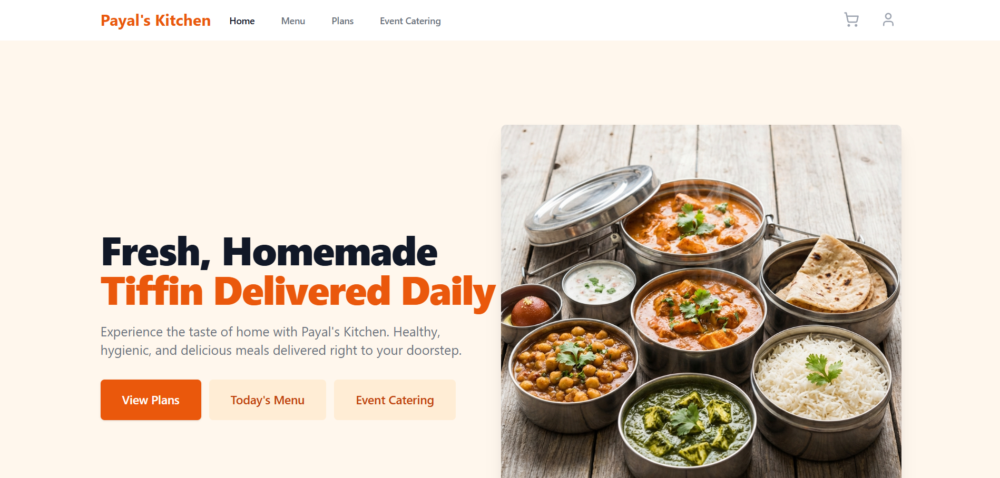
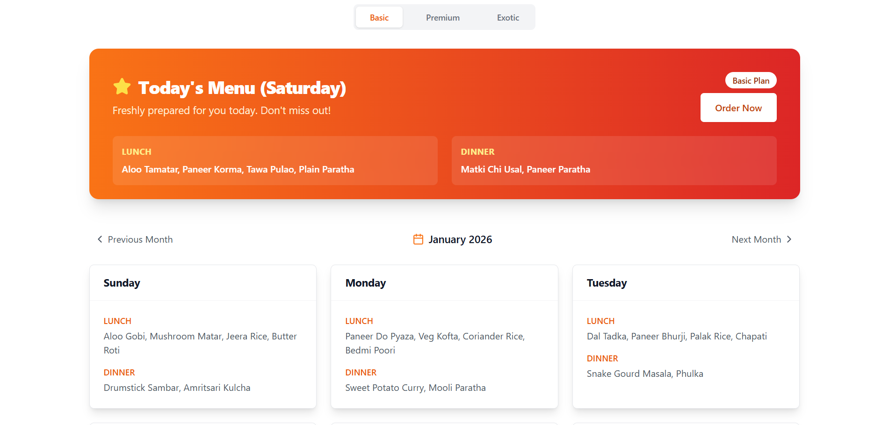

# Food Order Management System

A comprehensive full-stack web application for managing food subscriptions, event catering orders, and customer interactions. The system provides role-based access for customers, employees, and administrators with a modern, responsive interface.

## Screenshots

### Home Page


### Menu Page


## Features

### Customer Features
- **User Authentication**
  - Secure registration and login with JWT authentication
  - Password encryption using bcrypt
  - Profile management with address and dietary preferences

- **Subscription Management**
  - Browse and subscribe to meal plans (Basic, Premium, Exotic)
  - Monthly and yearly subscription options
  - View current subscription status and renewal dates
  - Track subscription history

- **Daily Menu**
  - View daily menus for lunch and dinner based on selected plan
  - Menu preview for upcoming dates
  - Weekend special menus for Premium and Exotic plans
  - Dietary preferences support

- **Custom Orders**
  - Place custom orders in advance (minimum 2 days notice)
  - Customize meal preferences and quantities
  - Track order status (Pending, Confirmed, Delivered, Cancelled)
  - Order history with filters

- **Event Catering**
  - Browse event catering menu items (Starters, Main Course, Desserts, Beverages)
  - Create event catering orders with custom quantities
  - Specify event date and delivery address
  - Track event order status

- **Shopping Cart**
  - Add custom orders and event catering items to cart
  - Apply discount coupons
  - Real-time price calculation
  - Integrated Razorpay payment gateway

- **Complaints & Feedback**
  - Submit complaints or feedback
  - Track complaint status (Pending, In Progress, Resolved)
  - Priority-based complaint handling
  - View complaint history

### Employee Features
- **Order Management**
  - View all pending orders
  - Update order status
  - Filter orders by date and status
  - Handle both custom and event orders

### Admin Features
- **Dashboard Analytics**
  - Total revenue and user statistics
  - Active subscriptions count
  - Pending orders overview
  - Revenue charts and analytics

- **User Management**
  - View all registered users
  - Update user roles (Customer, Employee, Admin)
  - Monitor user activity

- **Subscription Management**
  - View all active subscriptions
  - Monitor subscription renewals
  - Track subscription revenue

- **Order Management**
  - Comprehensive order oversight
  - Update order statuses
  - Revenue tracking per order

- **Complaint Management**
  - View and filter all complaints
  - Update complaint status and priority
  - Assign complaints to employees

- **Coupon Management**
  - Create discount coupons
  - Set coupon validity periods
  - Define minimum order amounts
  - Track coupon usage

## Technology Stack

### Frontend
- **Framework**: React 19.2.0
- **Build Tool**: Vite 7.2.4
- **Routing**: React Router DOM 7.10.1
- **HTTP Client**: Axios 1.13.2
- **Styling**: Tailwind CSS 3.4.17
- **Icons**: Lucide React 0.561.0
- **Charts**: Recharts 3.5.1

### Backend
- **Runtime**: Node.js
- **Framework**: Express.js 5.2.1
- **Database**: MongoDB (with Mongoose 9.0.1)
- **Authentication**: JWT (jsonwebtoken 9.0.3)
- **Password Hashing**: bcryptjs 3.0.3
- **Payment Gateway**: Razorpay 2.9.6
- **Environment Variables**: dotenv 17.2.3
- **CORS**: cors 2.8.5

### Development Tools
- **Server Development**: Nodemon 3.1.11
- **Linting**: ESLint 9.39.1
- **CSS Processing**: PostCSS 8.5.6, Autoprefixer 10.4.22

## Installation & Setup

### Prerequisites
- Node.js (version 16 or higher)
- MongoDB (local installation or MongoDB Atlas account)
- Razorpay account (for payment processing)
- npm or yarn package manager

### Step 1: Clone the Repository
```bash
git clone <repository-url>
cd order1
```

### Step 2: Server Setup

1. **Navigate to server directory**
   ```bash
   cd server
   ```

2. **Install dependencies**
   ```bash
   npm install
   ```

3. **Configure environment variables**
   
   Create a `.env` file in the server directory:
   ```bash
   PORT=5000
   MONGO_URI=your_mongodb_connection_string
   JWT_SECRET=your_jwt_secret_key
   NODE_ENV=development
   RAZORPAY_KEY_ID=your_razorpay_key_id
   RAZORPAY_KEY_SECRET=your_razorpay_key_secret
   ```

   **Environment Variables Explained:**
   - `PORT`: Port number for the server (default: 5000)
   - `MONGO_URI`: MongoDB connection string (e.g., `mongodb://localhost:27017/food-order` or MongoDB Atlas URI)
   - `JWT_SECRET`: Secret key for JWT token generation (use a strong random string)
   - `NODE_ENV`: Environment mode (development/production)
   - `RAZORPAY_KEY_ID`: Razorpay API key ID (from Razorpay dashboard)
   - `RAZORPAY_KEY_SECRET`: Razorpay API key secret (from Razorpay dashboard)

4. **Seed the database**
   
   Populate the database with initial data (plans, menus, event items):
   ```bash
   node seeder.js
   ```

5. **Start the server**
   
   For development (with auto-reload):
   ```bash
   npm run dev
   ```
   
   For production:
   ```bash
   npm start
   ```

   The server will run on `http://localhost:5000`

### Step 3: Client Setup

1. **Navigate to client directory** (open a new terminal)
   ```bash
   cd client
   ```

2. **Install dependencies**
   ```bash
   npm install
   ```

3. **Configure environment variables**
   
   Create a `.env` file in the client directory:
   ```bash
   VITE_RAZORPAY_KEY_ID=your_razorpay_key_id
   ```

   **Environment Variables Explained:**
   - `VITE_RAZORPAY_KEY_ID`: Razorpay API key ID (same as server, required for payment integration)

4. **Start the development server**
   ```bash
   npm run dev
   ```

   The client will run on `http://localhost:5173` (or another port if 5173 is in use)

5. **Build for production** (optional)
   ```bash
   npm run build
   ```

   The production build will be created in the `dist` directory.

### Step 4: Access the Application

1. Open your browser and navigate to `http://localhost:5173`
2. Register a new account or use the seeded admin account (if created)
3. Start exploring the features!

## Project Structure

```
order1/
├── client/                 # Frontend React application
│   ├── src/
│   │   ├── components/    # Reusable React components
│   │   ├── context/       # React Context providers (Auth, Cart, Order)
│   │   ├── pages/         # Page components
│   │   │   ├── admin/     # Admin dashboard pages
│   │   │   └── employee/  # Employee pages
│   │   └── App.jsx        # Main application component
│   ├── public/            # Static assets
│   └── package.json       # Frontend dependencies
│
├── server/                # Backend Express application
│   ├── config/           # Database configuration
│   ├── controllers/      # Route controllers
│   ├── middleware/       # Custom middleware (auth, error handling)
│   ├── models/           # MongoDB models (User, Order, Menu, etc.)
│   ├── routes/           # API routes
│   ├── seeder.js         # Database seeding script
│   └── server.js         # Main server file
│
└── README.md             # This file
```

## API Endpoints

### Authentication
- `POST /api/auth/register` - Register new user
- `POST /api/auth/login` - Login user
- `GET /api/auth/profile` - Get user profile (protected)
- `PUT /api/auth/profile` - Update user profile (protected)

### Plans
- `GET /api/plans` - Get all meal plans
- `GET /api/plans/:id` - Get plan by ID

### Subscriptions
- `POST /api/subscriptions` - Create subscription (protected)
- `GET /api/subscriptions/my-subscriptions` - Get user subscriptions (protected)
- `PUT /api/subscriptions/:id` - Update subscription (protected)

### Menu
- `GET /api/menu` - Get menus by date range and plan type
- `GET /api/menu/:id` - Get menu by ID

### Orders
- `POST /api/orders` - Create order (protected)
- `GET /api/orders/my-orders` - Get user orders (protected)
- `GET /api/orders` - Get all orders (admin/employee)
- `PUT /api/orders/:id` - Update order status (protected)

### Event Items
- `GET /api/event-items` - Get all event catering items

### Complaints
- `POST /api/complaints` - Submit complaint (protected)
- `GET /api/complaints/my-complaints` - Get user complaints (protected)
- `GET /api/complaints` - Get all complaints (admin)
- `PUT /api/complaints/:id` - Update complaint (protected)

### Coupons
- `GET /api/coupons` - Get all coupons (admin)
- `POST /api/coupons` - Create coupon (admin)
- `POST /api/coupons/validate` - Validate coupon code
- `DELETE /api/coupons/:id` - Delete coupon (admin)

## Default User Roles

After running the seeder, you can create users with different roles:

- **Customer**: Default role for all registered users
- **Employee**: Can manage orders and view customer data
- **Admin**: Full access to all features and management capabilities

## Database Seeding

The `seeder.js` script populates the database with:
- **Meal Plans**: Basic, Premium, and Exotic plans (monthly and yearly)
- **Menus**: 12 months of daily menus with unique dishes per month
- **Event Items**: Starters, Main Course, Desserts, and Beverages

Run the seeder command to reset and populate the database:
```bash
cd server
node seeder.js
```

## Payment Integration

The application uses Razorpay for payment processing:
1. Create a Razorpay account at [razorpay.com](https://razorpay.com)
2. Get your API keys from the dashboard
3. Add the keys to the `.env` files (both server and client)
4. Test the payment flow with Razorpay test cards

## Troubleshooting

### Common Issues

1. **MongoDB connection error**
   - Verify your MongoDB service is running
   - Check the `MONGO_URI` in the server `.env` file
   - Ensure your MongoDB Atlas IP whitelist includes your current IP (if using Atlas)

2. **Port already in use**
   - Change the `PORT` in server `.env` file
   - Kill the process using the port: `npx kill-port 5000`

3. **CORS errors**
   - Ensure the server is running on the correct port
   - Verify axios baseURL in the client code matches the server URL

4. **Payment gateway errors**
   - Verify Razorpay keys are correctly set in both `.env` files
   - Check Razorpay dashboard for test mode status

## Contributing

1. Fork the repository
2. Create a feature branch (`git checkout -b feature/YourFeature`)
3. Commit your changes (`git commit -m 'Add some feature'`)
4. Push to the branch (`git push origin feature/YourFeature`)
5. Open a Pull Request

## License

This project is licensed under the ISC License.

## Support

For issues or questions, please create an issue in the repository or contact the development team.

---

**Developed with ❤️ using MERN Stack**